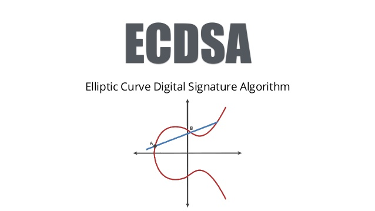
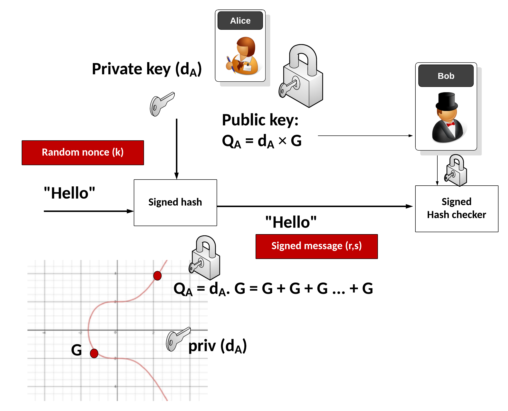

# ECDSA-protocol-in-Haskell
Implementation of ECDSA algorithm for key generation, message signing and verification.

ECDSA is an algorithm used in digital signatures.
The project implements the ECDSA algorithm in the functional language Haskell. The code should be sufficiently
commented, because I have no experience with this issue myself and I wrote it mainly for myself and future use of this project.
The application expects switches and subsequent structures on the input, depending on the specified switches.
Switches:
    -i prints information about the specified curve to stdout
    -k Generates a public and private key for the specified curve, which can be used to sign the message
    -s For the given curve, key and hash, generate a signature
    -v For the given curve, public call, signature and hash, validates the signature.
The pointers to the individual structures that must be passed to the program are in the attached tests in the /test folder.

In case the user is entering input from a stdin, he must send an empty line to end the input.
The tests are more like a display of the input in the .in files. The .out files cannot be used in any reasonable way,
because random numbers are generated and the program cannot pip one after another ./flp-22 -k | ./flp-22 -s | ./flp-22 -v due to the input specification (Key vs PublicKey).

The full specification should be implemented, i.e. key generation, message signing and signature verification. 
The application has been tested on the sequence of generate key, sign message and subsequent verification. If the hash or key is modified, verify no longer returns False. Testing was also done on a Merlin reference machine where I wrapped the project for commit using Makefile, moved it to an empty folder and unwrapped it. All the switches where it was possible to sign and verify the message were enabled. The input was also entered manually from stdin.

I was unable to compile the application with the ghc tool, as it complained about the missing Random library, which of course was installed on the system. Therefore cabal was chosen for local development, which was recommended in the FLP course tutorial.

Unfortunately cabal is not installed on the Merlin reference machine, so Makefile, which uses the ghc compiler, was made operational for the Merlin translation.

image from: [asecuritysite.com](https://asecuritysite.com/ecc/ecdsa)
